<p align="center">
  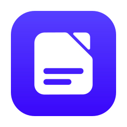
</p>

<h1 align="center">DocBox</h1>

<p align="center">
  <b>Read text from images and PDFs, on your own computer.</b><br>
  Pick an OCR model and DocBox sets everything up for you. No account, no cloud.
</p>

<p align="center">
  <a href="../../releases/latest">Download</a> ·
  <a href="#tutorial">Tutorial</a> ·
  <a href="#which-engine-should-i-use">Which engine?</a> ·
  <a href="#development">Development</a>
</p>

---

DocBox is a desktop app for **Windows, macOS (Apple Silicon) and Linux** that runs
open-source OCR (optical character recognition) models locally. It checks your computer's
memory and disk, tells you which models will run well, and installs everything a model
needs (its engine, the model files, even helper programs) with one click. Your documents
never leave your computer unless you choose the optional NVIDIA cloud engine.

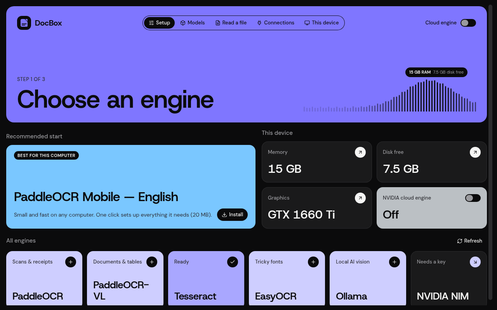

## Contents

- [Install](#install)
- [Tutorial](#tutorial)
  1. [First launch](#1-first-launch)
  2. [Set up your first model](#2-set-up-your-first-model-one-click)
  3. [Read a file](#3-read-a-file)
  4. [Explore other engines](#4-explore-other-engines)
  5. [Connections: Ollama, Tesseract, NVIDIA](#5-connections-ollama-tesseract-and-nvidia)
  6. [Free up space](#6-free-up-space)
  7. [Updates](#7-updates)
- [Which engine should I use?](#which-engine-should-i-use)
- [Troubleshooting](#troubleshooting)
- [Privacy](#privacy)
- [Development](#development)
- [Command line](#command-line)
- [Releasing](#releasing)
- [Running the backend in Docker](#running-the-backend-in-docker)
- [License](#license)

## Install

Download the latest version from the **[Releases page](../../releases/latest)**.

| System | Download | How to install |
|---|---|---|
| Windows 10/11 | `DocBox-x.y.z-windows-x86-64.exe` | Run it. No admin rights needed; it installs for your user only. |
| Windows (IT-managed) | `DocBox-x.y.z-windows-x86-64.msi` | The same app as an MSI package. |
| macOS 12+ (Apple Silicon) | `DocBox-x.y.z-macos-arm-64.dmg` | Open it and drag DocBox to Applications. |
| Linux (any distro) | `DocBox-x.y.z-linux-x86-64.AppImage` | `chmod +x DocBox-*.AppImage`, then double-click it or run it. |
| Debian / Ubuntu | `DocBox-x.y.z-linux-x86-64.deb` | `sudo apt install ./DocBox-*.deb` |

> **Windows says "Windows protected your PC"?** The installer isn't code-signed yet, so
> SmartScreen doesn't recognise it. Click **More info → Run anyway**.
>
> **macOS won't open DocBox?** It isn't notarized by Apple yet. Open **System Settings ›
> Privacy & Security** and click **Open Anyway** next to DocBox. Intel Macs aren't
> supported: PaddleOCR has no Intel macOS build. EasyOCR needs macOS 14 or later.

The installer is small (about 16 MB). DocBox downloads the rest when you need it.

## Tutorial

### 1. First launch

The first time you open DocBox it sets up its own private Python runtime. This takes a
minute or two and needs an internet connection. It happens only once, and it never
touches any Python you already have.

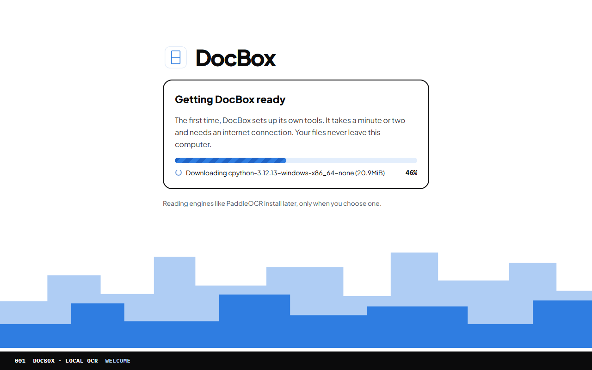

After that, DocBox opens in a second or two.

### 2. Set up your first model (one click)

DocBox opens on **Setup**. The **Recommended start** card is the best first choice for
most people: *PaddleOCR Mobile — English*, which is small, fast and works on any computer.

Click **Install**. That one click does everything: the first time you use an engine,
DocBox also installs its software, then downloads the model. You'll see a single progress
bar for the whole job, and you can **pause** it and pick it up again later.

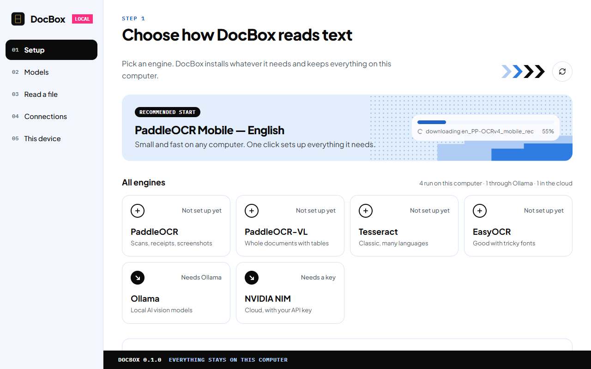

When it's done, the card says **Installed** and offers **Read a file**.

### 3. Read a file

Go to **Read a file** and drop images or PDFs onto the box, click **Choose files**, or
**Paste from clipboard** (Ctrl+V works too). Pick a model and how to save the text:
**Plain text**, **Markdown**, a **Searchable PDF** (your scan with selectable text) or
**JSON**. Then click **Read text**. DocBox reads every page, one file at a time, and saves
the result to a `DocBox` folder in your Documents.

Finished files appear under **Recent files**. Click one to see each line with a
confidence bar, copy the text, or open the saved file. The model you mark as
**Use as default** (on **Models**) is picked first.

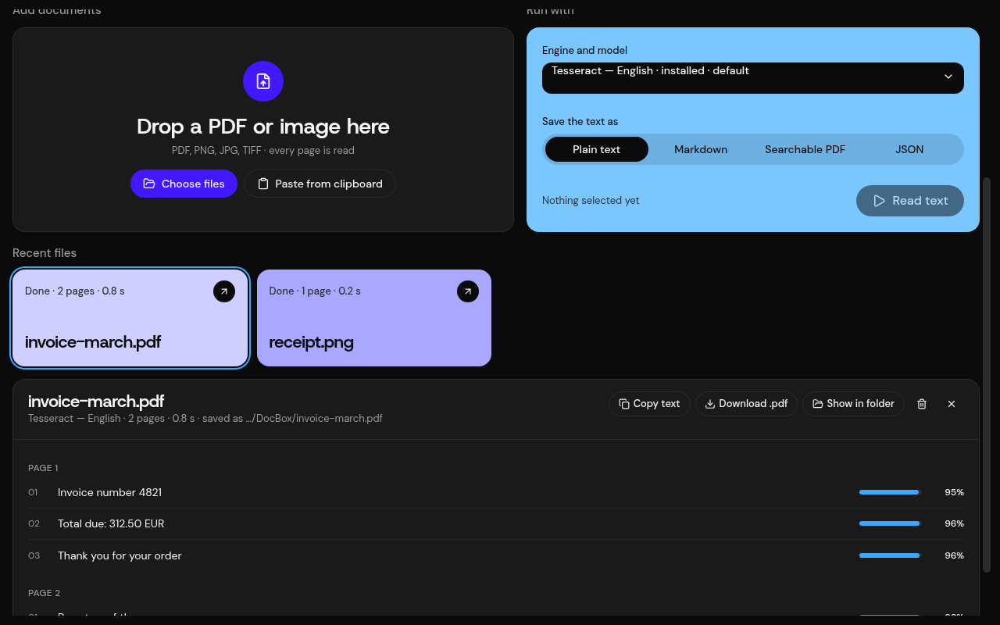

### 4. Explore other engines

Click any engine card on **Setup** to see what it's good for, a **Which one do I need?**
tip, and all its versions. Each version shows its size and whether it fits your
computer. The button always tells you what a click will do:

- **Install**: just the model files.
- **Install engine + model**: the first time you use that engine.
- **Needs Ollama** / **Needs Tesseract**: it needs a helper program (see step 5).

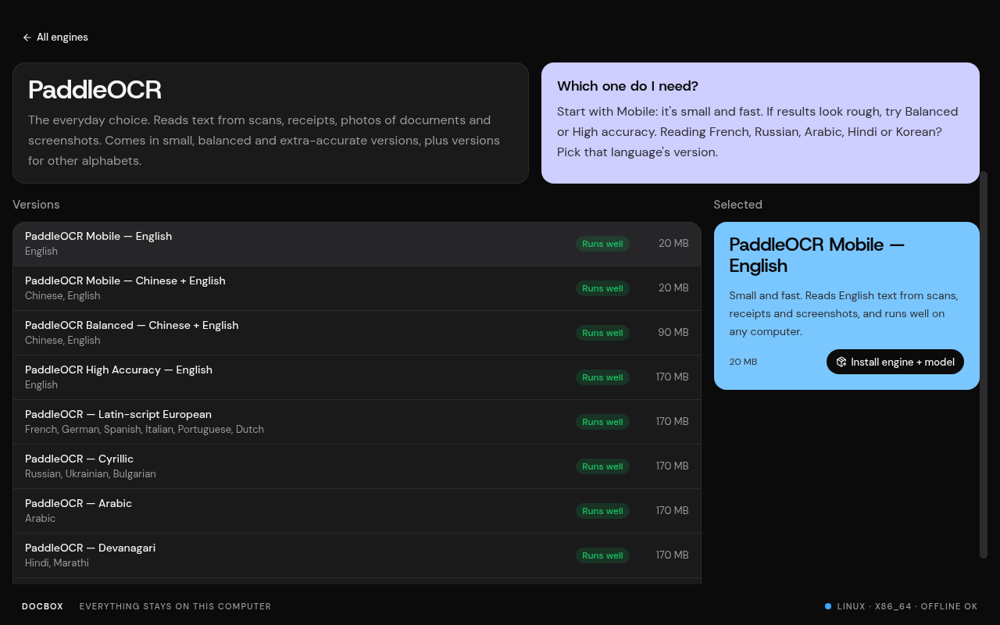

### Benchmarks: which model reads your documents best?

**Benchmarks** is a test bench for your own documents. Drop a folder (or pick files), tick
the models to compare and click **Start benchmark**: every page goes to every model, one
model at a time. Each run becomes a batch you can open, run again or delete.

The leaderboard plots each model's accuracy against what it costs (seconds per page, peak
memory or load time), cheapest on the right, so the most efficient models sit top right;
one model's sizes (PaddleOCR Mobile and Large, say) are joined by a line. Below it, ranked
bars show each model's accuracy with its 95% interval, beside its speed, peak memory and
load time. **Compare** puts a page next to every model's reading of it, with each mistake
("slip") highlighted. One click makes the winner your default model.

Accuracy needs the correct text: put `invoice.gt.txt` next to `invoice.pdf` (or
`invoice.p2.gt.txt` for page 2 only). Without it, models are ranked by speed.

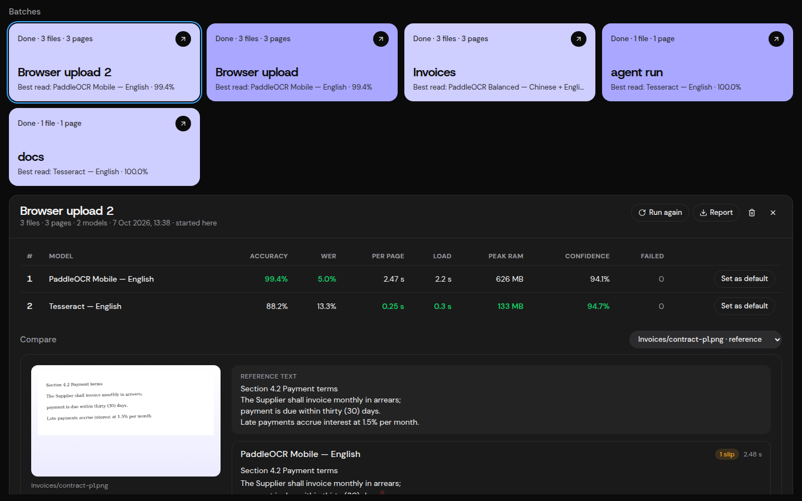

### 5. Connections: Ollama, Tesseract and NVIDIA

Some engines use a program or service from outside DocBox. **Connections** shows each
one's status and how to set it up.

- **Ollama** runs AI vision models locally. On Windows, click **Install Ollama for me**.
  DocBox uses Windows' own installer, so you'll see Windows' permission prompt. On macOS
  and Linux, copy the command shown and run it in a terminal (on macOS it uses Homebrew). Then pick a model under
  **Setup › Ollama** and DocBox downloads it through Ollama.
- **Tesseract** is a classic OCR program with the same one-click (Windows) or one-command
  (macOS, Linux) setup. DocBox then downloads its language files itself.
- **NVIDIA NIM** runs models in NVIDIA's cloud using your own API key (get one at
  [build.nvidia.com](https://build.nvidia.com)). It's the only option that sends images
  off your computer, so it only works while the **Cloud engine** switch (top right) is on.
  Switch it off and NVIDIA's models disappear until you switch it back.

Press **Check again** after installing anything.

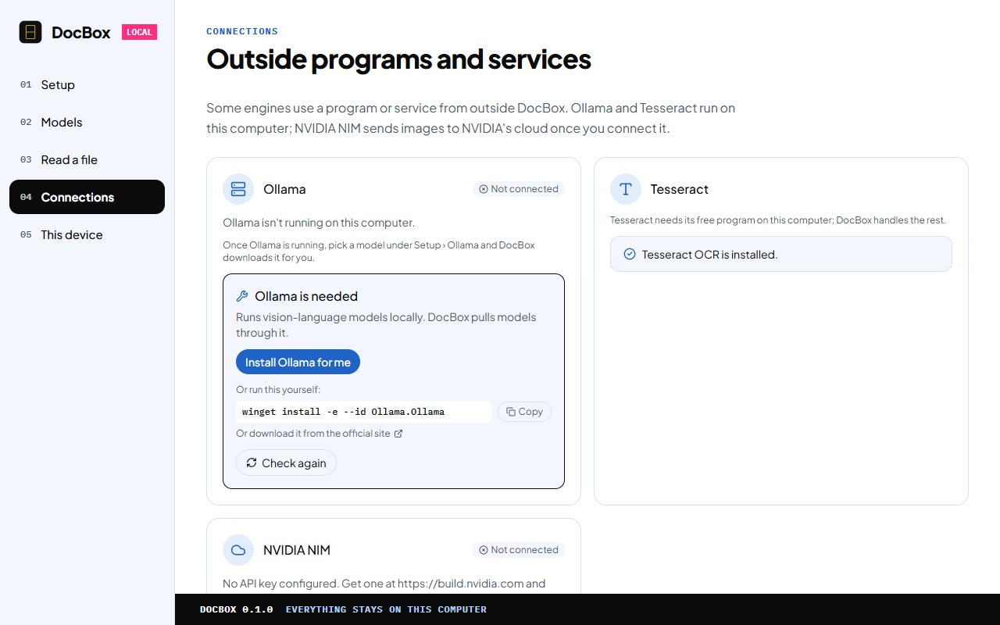

DocBox never installs a system program silently: you always press the button, and
Windows always asks too.

### 6. Free up space

Every model you've downloaded has a **Remove** button, with a confirmation before
anything is deleted.

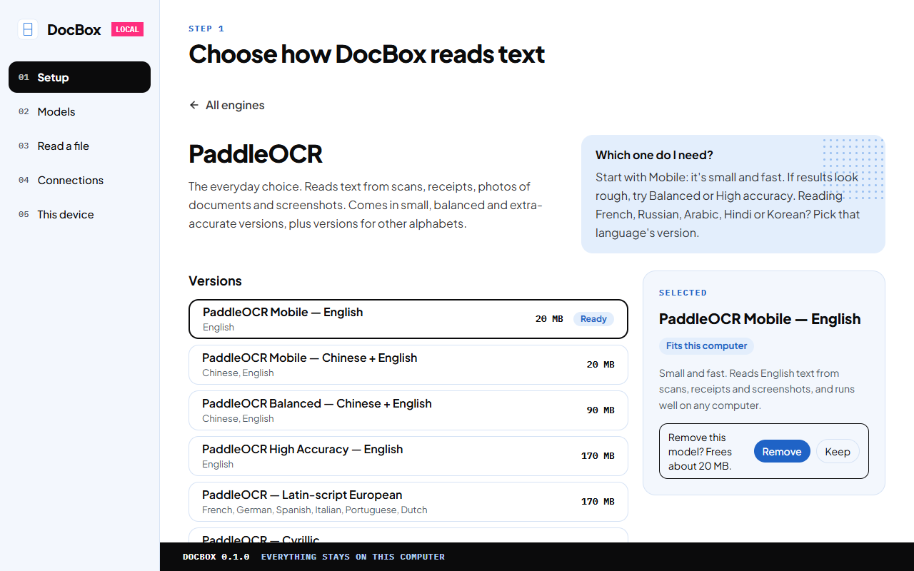

**Models** shows how much space your models use, and **Engines on disk** at the bottom
lists each engine and its models. **Uninstall** removes an engine and all of its models. If you used that engine
in this session, the removal finishes the next time DocBox starts.

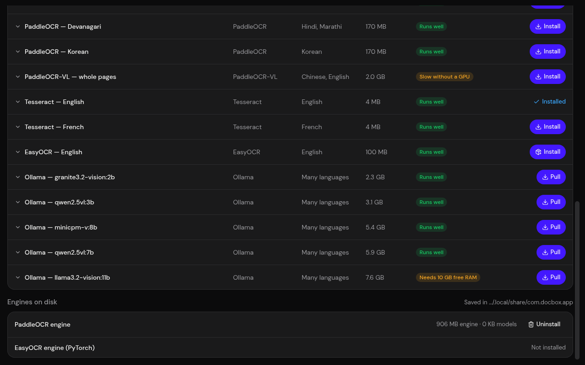

**This device** shows the memory, processor, free disk and graphics card DocBox uses to
decide which models will run comfortably.

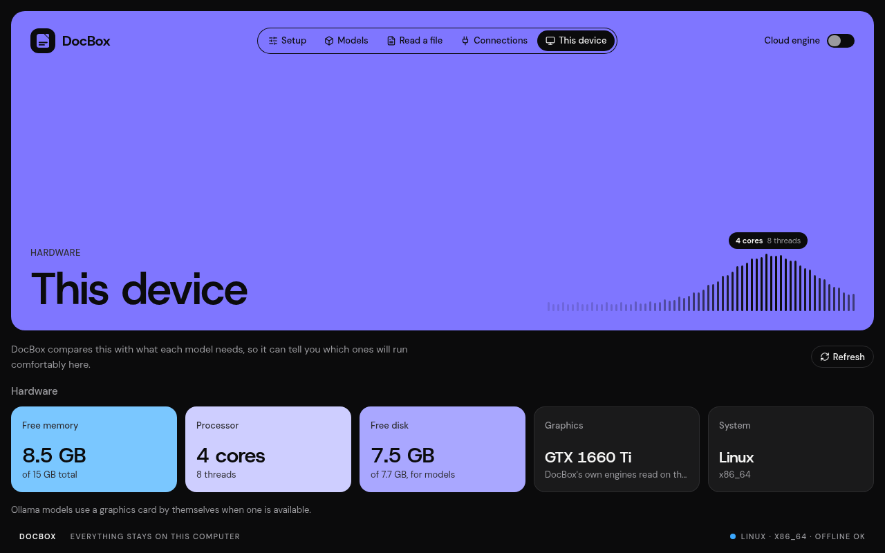

### 7. Updates

DocBox checks for a new version each time it starts. When there is one, a bar at the top
offers **Install & restart**: DocBox downloads the update, checks its signature, installs it
and reopens. On Linux, a `.deb` or `.rpm` install asks for your password first, like any
system package. Your engines, models and settings are kept. If the update can't be
installed from inside the app, the bar offers **Download** instead, which opens the
Releases page: install the new version over the old one.

## Which engine should I use?

| Engine | Best for | Size | Needs |
|---|---|---|---|
| **PaddleOCR** | Everyday scans, receipts, screenshots. Start here. | 20–170 MB per model (+ engine, once) | nothing |
| **PaddleOCR-VL** | Whole pages with tables and headings, in reading order | ~2 GB, powerful computer | nothing |
| **Tesseract** | Clean printed pages, many languages | ~4 MB per language | the free Tesseract program |
| **EasyOCR** | Unusual or decorative fonts | ~100 MB (+ larger engine, once) | nothing |
| **Ollama** | AI models that look at the whole image; good on messy pages | 2–8 GB per model | the free Ollama program |
| **NVIDIA NIM** | Big cloud models when your computer is too slow | none | an NVIDIA API key; images go to NVIDIA |

Languages: PaddleOCR has versions for English, Chinese, Latin-script European languages
(French, German, Spanish, Italian, Portuguese, Dutch), Cyrillic (Russian, Ukrainian,
Bulgarian), Arabic, Devanagari (Hindi, Marathi) and Korean.

## Troubleshooting

- **"DocBox couldn't start" on first launch:** check your internet connection and click
  **Try again**. The screen shows where the logs are (`setup.log`, `backend.log`).
- **A download failed:** check your connection and click the button again to retry.
- **Ollama says "isn't running":** start the Ollama app, or click **Start Ollama** in
  **Connections**, then **Check again**.
- **Where's my data?** In `%LOCALAPPDATA%\io.github.docboxai.docbox` on Windows,
  `~/Library/Application Support/io.github.docboxai.docbox` on macOS or
  `~/.local/share/io.github.docboxai.docbox` on Linux; **Engines on disk** on the Models
  page shows it too. Read history (the text of files you've read) is in its `history`
  folder; saved results are in `Documents/DocBox`. To remove everything after uninstalling
  the app, delete that folder.

## Privacy

DocBox has no account, no telemetry and no analytics. OCR runs on your computer. The
only network traffic is downloading DocBox's runtime, engines and models (from PyPI,
the model publishers and GitHub), the update check on GitHub Releases, and, only while
the cloud engine is switched on and connected, sending images to NVIDIA's cloud. The text
of files you read is kept on this computer (Recent files) until you remove it there.

---

## Development

<details>
<summary><b>How it's put together</b></summary>

- **Desktop shell:** [Tauri 2](https://tauri.app/) (Rust) hosting a React + TypeScript +
  Tailwind UI (`frontend/`).
- **Backend:** a local [FastAPI](https://fastapi.tiangolo.com/) server
  (`src/docbox/backend/`) that the shell starts on launch and stops on exit; the UI talks
  to it over `http://127.0.0.1:<port>`.
- **Python runtime (installed app):** the installer bundles the backend source, its
  `uv.lock` and [uv](https://docs.astral.sh/uv/) as a sidecar. On first launch the shell
  runs `uv sync` against the bundled lockfile into the per-user data folder, downloading a
  managed CPython, so every machine gets the exact pinned versions. When an update ships a
  new lockfile, the environment is re-synced, with any engines the user had installed.
- **Engines on demand:** heavy engine packages are pyproject extras (`paddle`,
  `easyocr`). `core/runtime.py` installs one with the bundled uv the first time a model
  needs it, and removes it on uninstall.
- **Models:** a `ModelSpec`/`OCREngine` registry (`core/registry.py`, `engines/`);
  Ollama and NVIDIA NIM models are discovered live (`platforms/`).

</details>

**Requirements:** [uv](https://docs.astral.sh/uv/), [Node.js](https://nodejs.org/) 20+,
[Rust](https://www.rust-lang.org/tools/install) with
`cargo install tauri-cli --version "^2" --locked`, and on Linux
[Tauri's system packages](https://tauri.app/start/prerequisites/).

```sh
uv sync --extra paddle           # base + PaddleOCR (--all-extras adds EasyOCR/PyTorch)
npm --prefix frontend install
cargo tauri dev                  # from the repository root
```

A plain `uv sync` removes extras you didn't pass, so always pass the ones you want.

- Backend only: `uv run python -m docbox.backend.main --port 8756`, then
  `http://127.0.0.1:8756/docs`.
- Frontend only: `npm --prefix frontend run dev`. In a plain browser the app calls `/api` on
  its own origin and Vite proxies it to `http://127.0.0.1:8756` (set `DOCBOX_BACKEND_URL`
  to point elsewhere), so it also works behind a reverse proxy or from another device.
- Tests and lint: `uv run pytest`, `uv run ruff check src/docbox tests`.
- Local installer: `cargo tauri build` from the repository root. `build.rs` copies your
  own `uv` in as the sidecar when `src-tauri/binaries/` is empty.

The logo's source is `src-tauri/icons/logo.svg`; regenerate the icon set with
`cargo tauri icon src-tauri/icons/logo.svg`.

## Command line

DocBox also works from a terminal, and AI agents can use it the same way (every command
takes `--json`):

```sh
uv tool install git+https://github.com/docboxai/docbox-app   # or, from a checkout: uv run docbox
docbox device                                    # memory, processor, disk, data folder
docbox models list --fits                        # what runs well here
docbox models install paddleocr-mobile-en        # engine + model, one step
docbox read scans/ --model paddleocr-mobile-en --format md --recursive
docbox settings set default-model paddleocr-mobile-en
```

### Benchmark the models on your own documents

```sh
docbox bench run invoices/ --models paddleocr-mobile-en,tesseract-eng,paddleocr-balanced
docbox bench show <run-id>          # leaderboard
docbox bench page <run-id> invoice.pdf 2   # every model's reading of one page, mistakes marked
docbox bench report <run-id> -f md  # or csv, json
```

Each model reads every page in its own process, one model after another, so speed and
peak memory are measured fairly. Accuracy needs reference text: put `invoice.gt.txt` (the
whole document) or `invoice.p2.gt.txt` (one page) next to `invoice.pdf`, or list files and
references in a manifest (`bench.json`):

```json
{"name": "Invoices", "items": [
  {"file": "a.pdf", "gt_file": "a.txt"},
  {"file": "b.png", "gt": "Total due $1,284.00"},
  {"file": "c.pdf", "pages": [{"page": 2, "gt": "..."}]}
]}
```

Without references, models are ranked by speed. Runs are saved in the data folder
(`benchmarks/`).

### AI agents (MCP)

`docbox mcp` is an MCP server, so Claude Code, Claude Desktop, Cursor or VS Code can set up
models, read files and run benchmarks for you. `docbox mcp config claude-code` (or
`claude-desktop`, `cursor`, `vscode`) prints the setup. See [docs/agents.md](docs/agents.md).

It uses the desktop app's models, settings and Recent files when the app is installed.
Exit codes: `0` ok, `1` error, `2` usage, `3` needs Tesseract or Ollama, `4` blocked (cloud
engine off).

## Releasing

`.github/workflows/release.yml` builds Windows (`.exe`, `.msi`), macOS on Apple Silicon
(`.dmg`, ad-hoc signed, not notarized) and Linux (`.AppImage`, `.deb`, `.rpm`) installers,
names them `DocBox-<version>-<os>-<arch>` and creates a **draft** GitHub Release with
GitHub's list of changes. Releases come only from `main`: the workflow refuses a tag on any
commit that isn't on `main`.

Each installer is signed for the in-app updater with the `TAURI_SIGNING_PRIVATE_KEY` and
`TAURI_SIGNING_PRIVATE_KEY_PASSWORD` repository secrets, and the release carries a
`latest.json` naming the file and signature for each kind of install (plus the macOS
`.app.tar.gz` the updater installs). Every installed copy, back to 0.1.0, checks
`releases/latest/download/latest.json` and accepts only updates signed with that key
(`plugins.updater.pubkey` in `tauri.conf.json`), so keep both secrets: losing the key means
existing installs can't update in-app any more.

To release: bump the version in `src-tauri/tauri.conf.json`, `src-tauri/Cargo.toml` and
`pyproject.toml` on `main` (the workflow refuses a mismatch), then tag that commit and push
the tag: `git tag -a v0.2.0 -m "DocBox 0.2.0" && git push origin v0.2.0`. Edit the list of
changes in the draft release, then publish it; installed copies offer the update from then
on.

## Running the backend in Docker

The desktop shell doesn't containerize, but the backend runs headless:

```sh
docker compose up --build
```

The API is at `http://localhost:8756` (Swagger UI at `/docs`), published on loopback only
since it has no authentication. Five containers: `backend` (the orchestrator) plus one per
engine family (`paddleocr`, `paddleocr-vl`, `tesseract`, `easyocr`), each installing only
its own engine's packages and keeping models in its own volume. To use Ollama from the
container, start it on the host with `OLLAMA_HOST=0.0.0.0 ollama serve`.

## Project layout

```
src/docbox/backend/   FastAPI app: routes, registry, engines, runtime + prerequisite managers
src-tauri/            Rust shell: first-run setup, backend lifecycle
frontend/             React + TypeScript + Tailwind UI (Vite)
website/              the landing page (Next.js, deployed on Vercel)
tests/backend/        pytest suite
docs/screenshots/     README screenshots
.github/workflows/    CI and release pipelines
```

## License

Copyright 2026 DocBox AI team (Pranav and Pawan).

DocBox is licensed under the [Apache License, Version 2.0](LICENSE). See [NOTICE](NOTICE)
for attribution, including the third-party font the searchable-PDF writer embeds.
